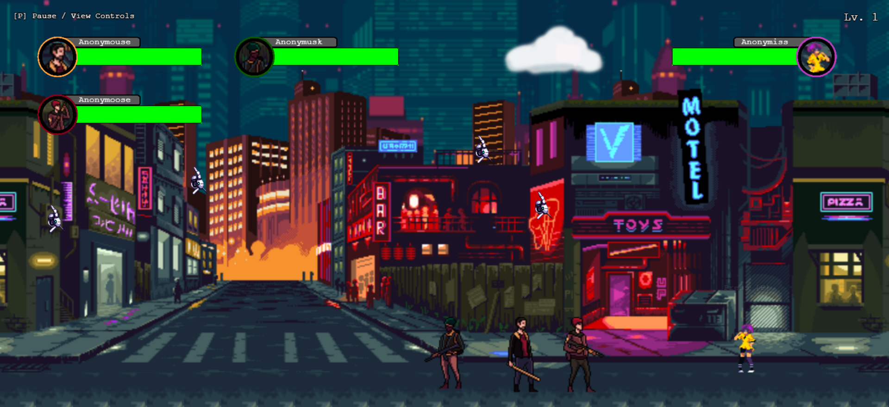

# Hackermans &copy;
A platformer game made with Phaser.JS and TypeScript for the lulz. Maybe I'll make it a story. ¯\_(ツ)_/¯

## Prerequisites

- Node.js (Download and install from [here](https://nodejs.org/))

## Setup

1. Clone the repository:
   ```bash
   git clone https://github.com/your-username/untitled.git
2. Navigate to the Project directory
   ```bash
   cd untitled
3. Install the required dependencies:
   ```bash
   npm install
   
## Running the Game

1. Start the development server by running the following command:
    ```bash
    npm start
    
### Screenshot:


## Special Thanks
Game Assets (sprites, music, pixel art) - Asimuz (https://ansimuz.itch.io/)
