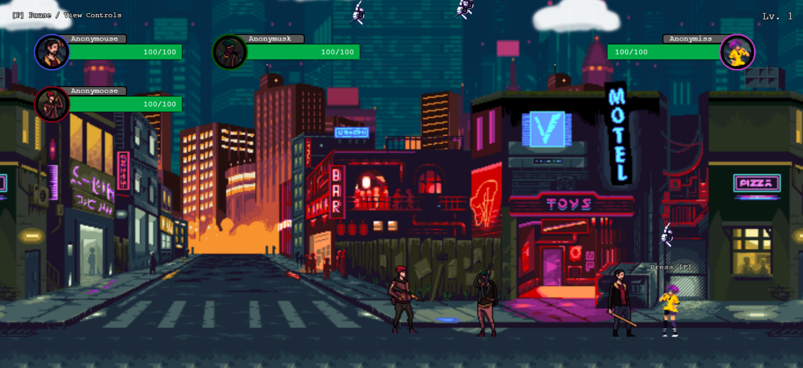
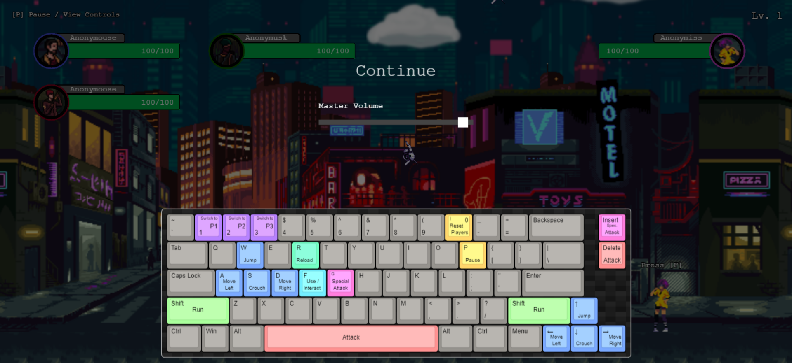

# :video_game: Hackermans &copy;
A platformer game made with Phaser.JS and TypeScript for the lulz. Maybe I'll make it a story. ¯\\_(ツ)_/¯

## Prerequisites

- Node.js (Download and install from [here](https://nodejs.org/))

## Setup

1. Clone the repository:
   ```bash
   git clone https://github.com/judahpaul16/hackermans.git
2. Navigate to the Project directory
   ```bash
   cd hackermans
3. Install the required dependencies:
   ```bash
   npm install
   
## Running the Game

1. Start the development server by running the following command:
    ```bash
    npm start

---

  



## Useful Links
| Phaser | LeshyLabs | Forums & Stuff |
| --- | --- | --- |
| [Phaser 3 Documentation](https://photonstorm.github.io/phaser3-docs/index.html) | [LeshyLabs SpriteSheet Tool](https://www.leshylabs.com/apps/sstool/) | [Game Development Stack Exchange](https://gamedev.stackexchange.com/) |
| [Phaser 3 Examples](https://phaser.io/examples) | [LeshyLabs Sound Effects Tool](https://www.leshylabs.com/apps/sfMaker/) | [Game Development Subreddit](https://www.reddit.com/r/gamedev/) |
| [Phaser 3 Tutorials](https://phaser.io/learn) | [LeshyLabs Spritesheet Animator](https://www.leshylabs.com/apps/spriteSheetAnimator/#demo) | [Game Development Discord](https://discord.gg/gameDev) |
| [Phaser Editor 2D](https://phasereditor2d.com/) | | [Keyboard Layout Editor](http://www.keyboard-layout-editor.com/) |

## Special Thanks
Game Assets (sprites, music, pixel art) - Asimuz (https://ansimuz.itch.io/)

## License
This project is licensed under the [GNU GPL v3.0](https://www.gnu.org/licenses/gpl-3.0.en.html) License - see the [LICENSE](LICENSE) file for details.